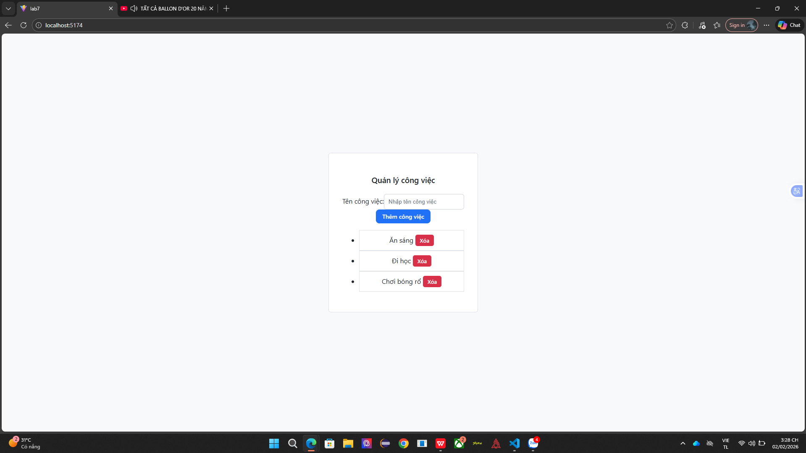
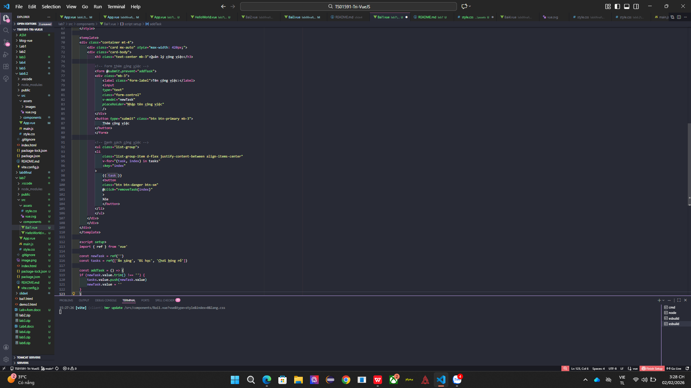
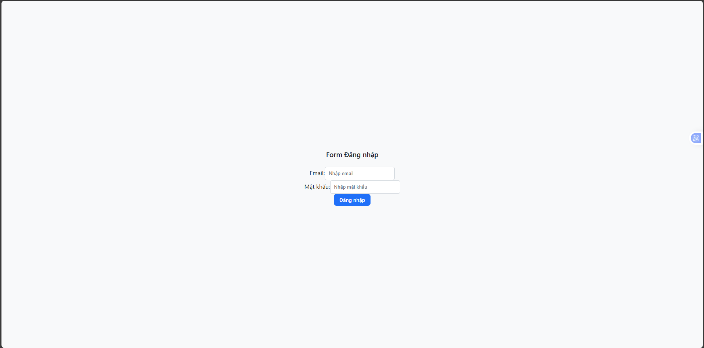
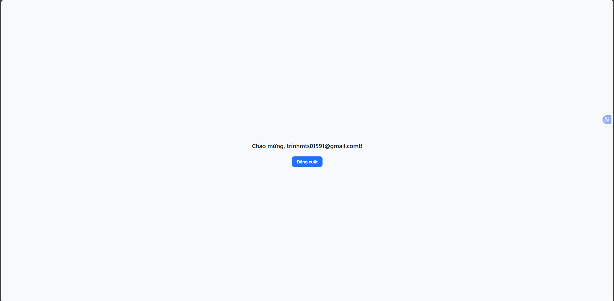
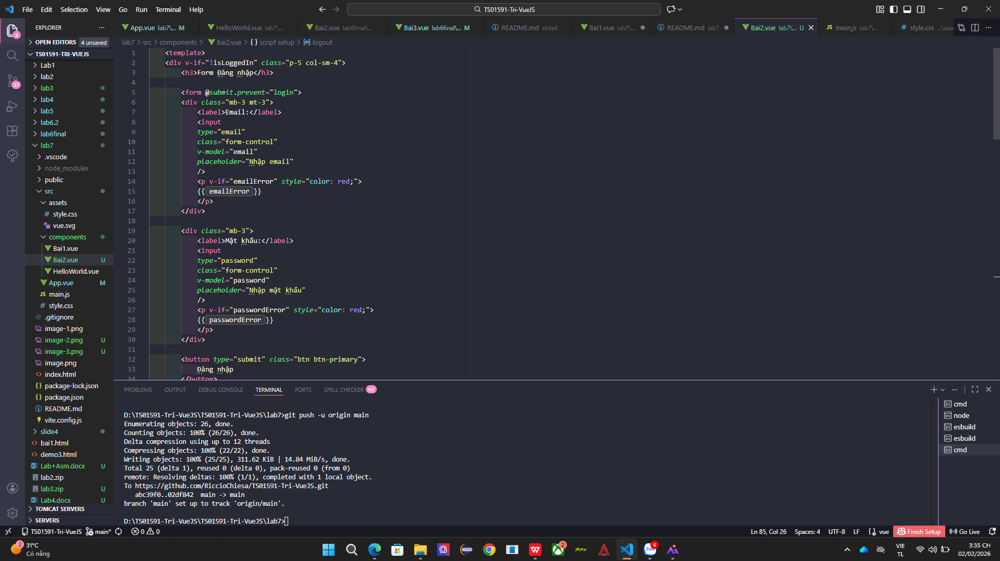
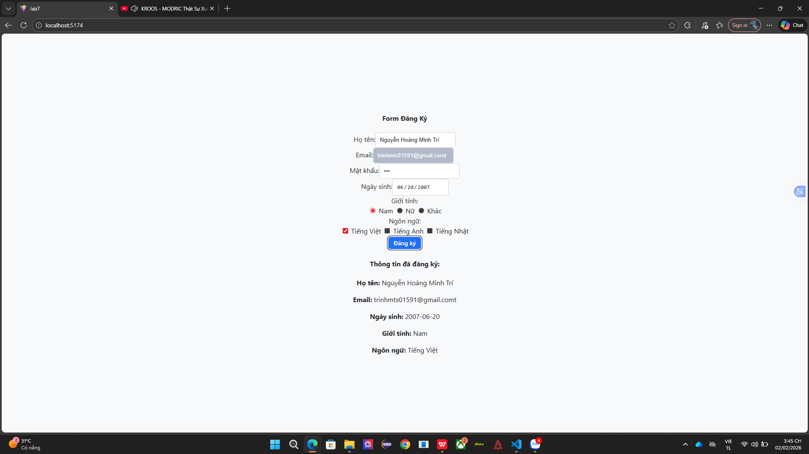
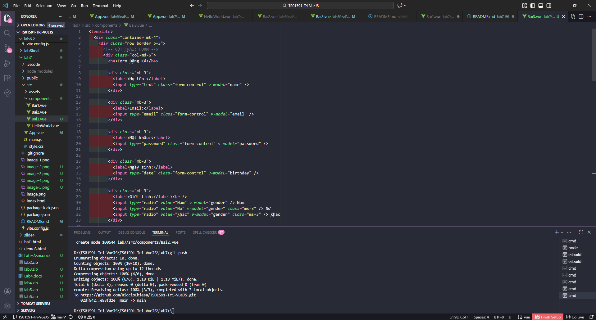
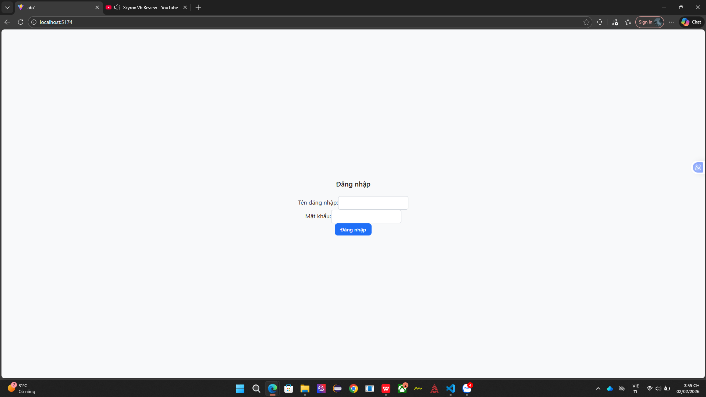
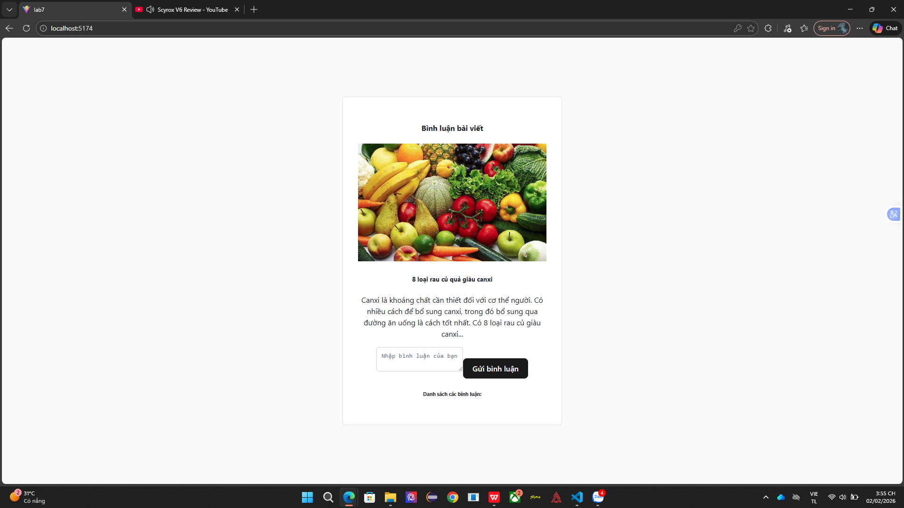

# Vue 3 + Vite

This template should help get you started developing with Vue 3 in Vite. The template uses Vue 3 `<script setup>` SFCs, check out the [script setup docs](https://v3.vuejs.org/api/sfc-script-setup.html#sfc-script-setup) to learn more.

Learn more about IDE Support for Vue in the [Vue Docs Scaling up Guide](https://vuejs.org/guide/scaling-up/tooling.html#ide-support).
bài 1

bài 2
theo em hiểu thì bài 2 sẽ không có 1 mật khẩu hay email nào cả nên chỉ cần nhập đúng email hợp lệ thì nó sẽ báo đăng nhập thành công

bài 3

bài 4

